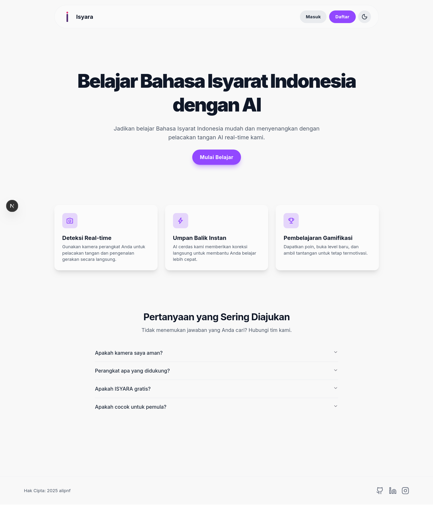
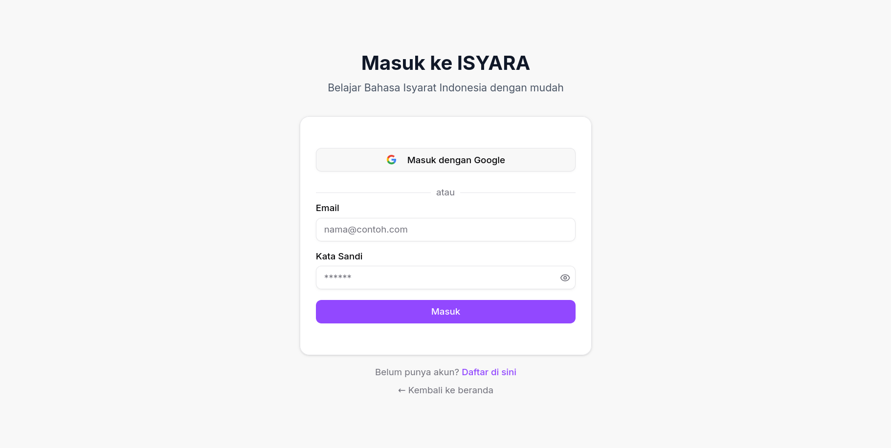
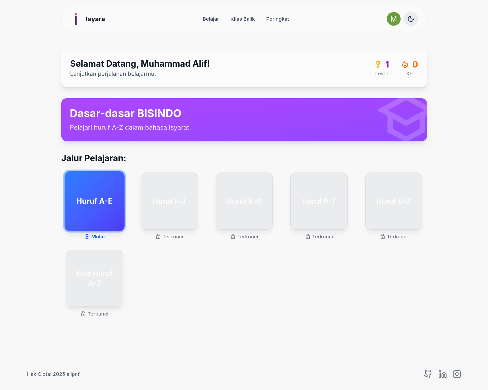
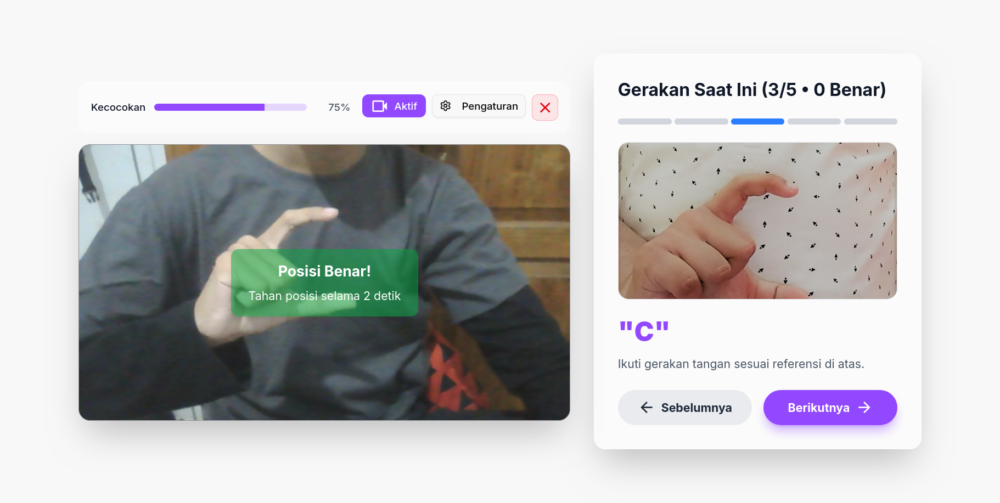
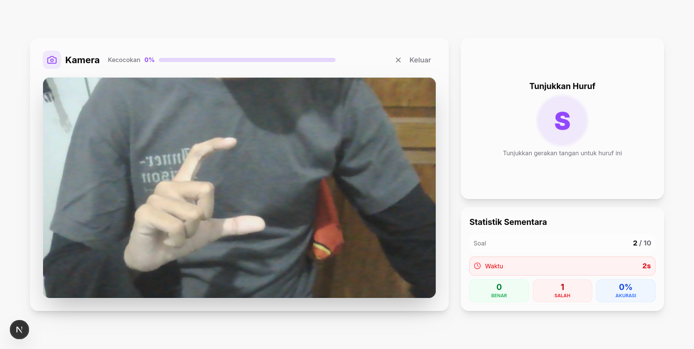
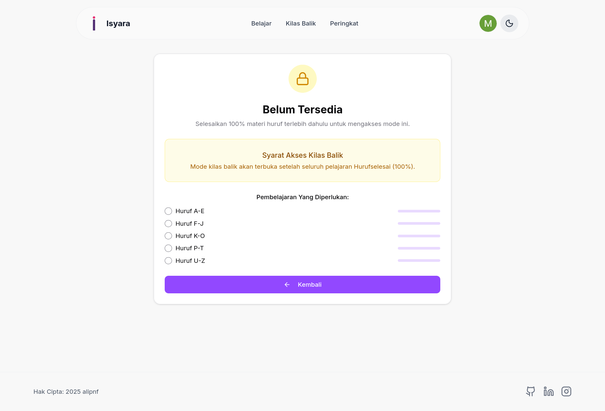
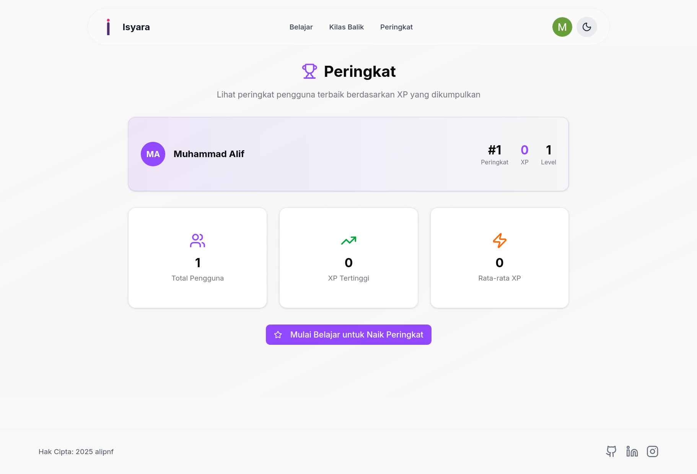
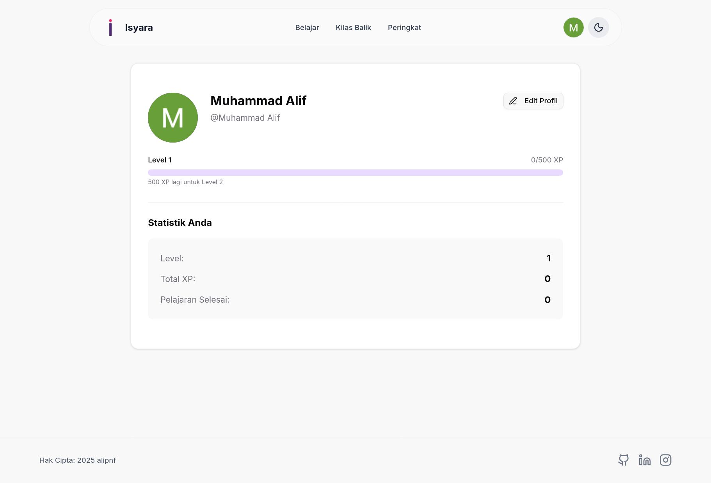

# Isyara-FE

Aplikasi web untuk belajar Bahasa Isyarat Indonesia (BISINDO) dengan deteksi
tangan real‑time, progres belajar, kuis, review, dan leaderboard.

## Ringkasan & Fitur

- Deteksi real‑time: Kamera perangkat digunakan untuk mendeteksi landmark tangan
  dan memprediksi huruf (A–Z) secara lokal di browser.
- Pembelajaran bertahap: Materi disusun per unit (mis. Huruf, Angka), dengan
  locking/unlocking, status current, dan progres per unit.
- Kuis & Review: Mode kuis dengan kamera, serta halaman review yang merangkum
  progres per kategori (huruf/angka/kata).
- Gamifikasi: XP, level, total lessons completed, dan leaderboard pengguna.
- Autentikasi: Email/password dan Google OAuth via Supabase.
- Admin: Halaman admin untuk kelola lesson definitions
  (menambah/mengedit/menghapus, mengatur urutan dan XP reward).

## Screenshots

|            Halaman Utama             |                 Login                  |                   Register                   |
| :----------------------------------: | :------------------------------------: | :------------------------------------------: |
|  |  |  |

|                Belajar                 |                Pelajaran                 |                 Kuis                 |
| :------------------------------------: | :--------------------------------------: | :----------------------------------: |
|  |  |  |

|               Kilas Balik                |                     Peringkat                      |                   Profil                   |
| :--------------------------------------: | :------------------------------------------------: | :----------------------------------------: |
|  |  |  |

## Teknologi Utama

- Next.js 15 (App Router).
- TypeScript + Tailwind CSS v4 + shadcn/ui.
- Supabase.
- TensorFlow.js + MediaPipe Hands untuk deteksi & klasifikasi gestur.

## Prasyarat

- Node.js 18+ (disarankan LTS terbaru).
- Paket manajer: pnpm (disarankan) atau npm.

## Menjalankan Secara Lokal

1. Clone dan masuk ke folder proyek:

   ```bash
   git clone <repo-url>
   cd Isyara-FE
   ```

2. Siapkan file `.env.local` (lihat bagian Variabel Lingkungan).

3. Instal dependensi:

   Dengan pnpm:

   ```bash
   pnpm install
   ```

   Atau dengan npm:

   ```bash
   npm install
   ```

4. Jalankan pengembangan:

   Dengan pnpm:

   ```bash
   pnpm dev
   ```

   Atau dengan npm:

   ```bash
   npm run dev
   ```

   Aplikasi akan tersedia di `http://localhost:3000`.

5. Build produksi dan jalankan:

   ```bash
   # build
   pnpm build   # atau: npm run build
   # start
   pnpm start   # atau: npm start
   ```

## Variabel Lingkungan (.env)

Buat file `.env.local` di root proyek dengan nilai berikut:

```env
NEXT_PUBLIC_SUPABASE_URL=<URL Supabase>
NEXT_PUBLIC_SUPABASE_PUBLISHABLE_KEY=<Anon/PUBLISHABLE key Supabase>

```
